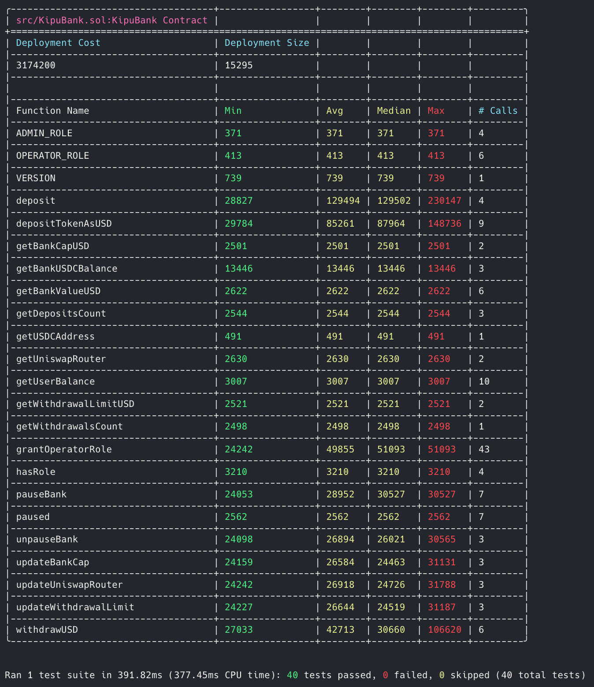
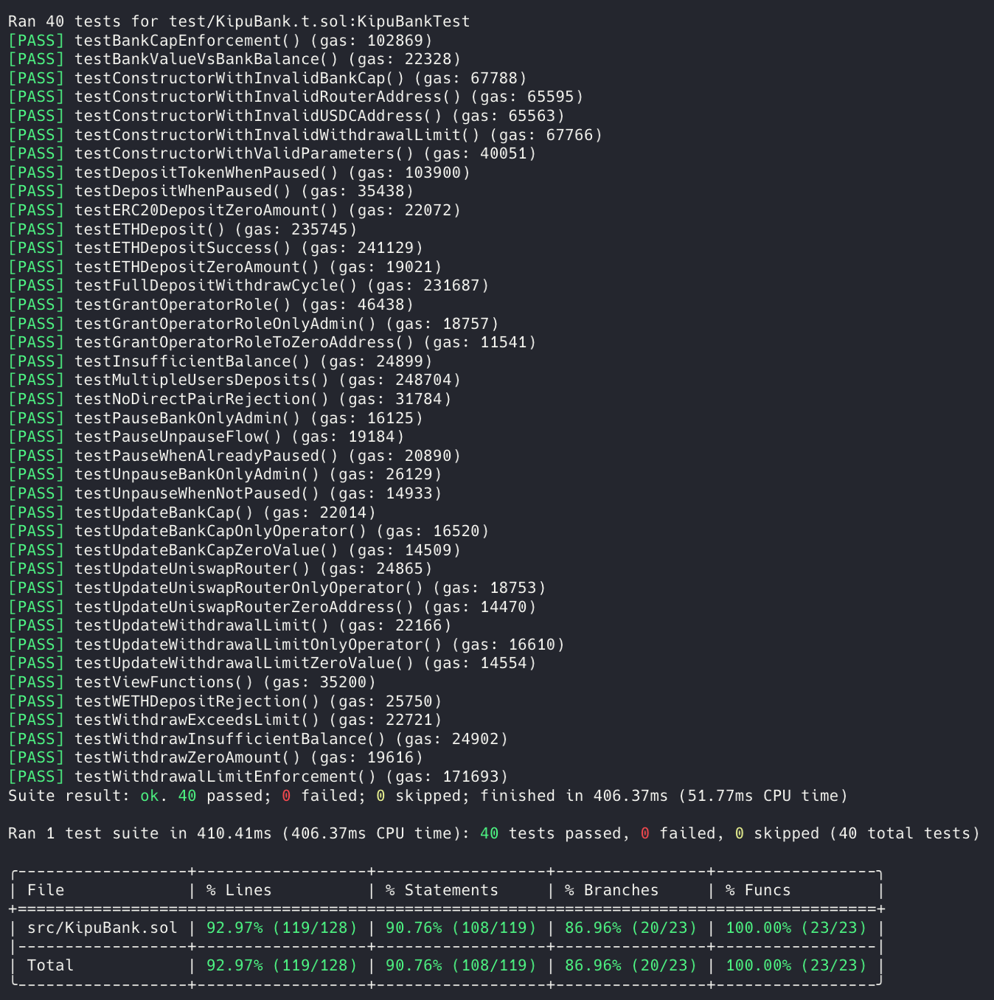

# KipuBank V3.3.0 - Multi-Token Decentralized Bank


## 📋 Overview

KipuBank is a smart decentralized bank that accepts deposits in ETH and multiple ERC20 tokens, automatically converting everything to USDC for unified storage. It uses Uniswap V2 for real-time swaps and maintains simplified accounting.

### Key Features

- **Multi-Token Support**: ETH and ERC20 tokens with direct USDC pairs on Uniswap V2
- **Automatic Conversion**: All deposits converted and stored as USDC
- **Gas Optimization**: 43% less gas on failed validations vs previous versions
- **Access Control**: Admin/Operator roles with real-time updateable limits
- **Advanced Security**: Reentrancy protection and comprehensive validations

## 🌐 Live Deployments

### Sepolia Testnet
- **Contract Address**: [`0xa4F1A735Cf70Dcea205178AC7b3548C85e9F655E`](https://sepolia.etherscan.io/address/0xa4f1a735cf70dcea205178ac7b3548c85e9f655e)
- **Network**: Ethereum Sepolia Testnet
- **Version**: KipuBank V3.3.0

## 🚀 Foundry Quick Start

### Installation & Setup

```bash
# Clone repository
git clone https://github.com/mpielvitori/KipuBankV3.git
cd KipuBankV3

# Install dependencies
forge install OpenZeppelin/openzeppelin-contracts
forge install Uniswap/v2-periphery
forge install foundry-rs/forge-std

# Configure environment
cp .env.example .env
# Edit .env with your ETH_RPC_URL Keys (Alchemy/Infura)
```

### Build & Testing

```bash
# Compile contracts
forge build

# Run all tests (script/ automatically excluded)
forge test

# Tests with gas report
forge test --gas-report

# Specific test with detailed logs
forge test --match-test testETHDepositSuccess -vvv

# Test coverage (script/ automatically excluded)
forge coverage
```

### Coverage Report

```bash
# Generate coverage report
forge coverage --report lcov -r coverage/lcov.info

# Generate HTML report
genhtml coverage/lcov.info -o coverage

# Open coverage/index.html in browser to view detailed coverage report
open coverage/index.html
```

##### install LCOV on MacOS
```bash
brew install lcov
```

#### 📊 Test Results

#### Gas Report


#### Coverage Report  


## 🔧 Foundry Debugging & Development

### Specific Tests
```bash
# Test gas optimization
forge test --match-test testBankCapEnforcement --gas-report

# Test operator functions
forge test --match-test testUpdateWithdrawalLimit -vvv

# Test token validation
forge test --match-test testNoDirectPairRejection -vvv
```

### Tracing & Debugging
```bash
# Debug with breakpoints
forge test --match-test testDepositToken --debug

# Verify storage slots
forge inspect KipuBank storage-layout
```

### Deployment

📝 **Environment Configuration**: Set the `ENVIRONMENT` variable in your `.env` file to target the desired network:
- **For Mainnet/Mainnet fork**: Set `ENVIRONMENT=MAINNET`
- **For Sepolia**: Set `ENVIRONMENT=SEPOLIA`

The script will automatically use the correct `UNISWAP_V2_ROUTER_*` and `USDC_*` variables based on your environment setting.

### Local Deploy

```bash
# Exports .env variables
source .env

# Start local network with mainnet fork
anvil --fork-url $ETH_RPC_URL
```

On another terminal:
```bash
# Using the data from anvil, import your wallet using its private key
cast wallet import wallet0 --interactive

# Deploy to local network
forge script script/KipuBank.s.sol:KipuBankScript  --rpc-url $RPC_URL --broadcast --account wallet0 --sender $ADMIN_WALLET_ADDRESS
```

### Deploy and verify on Sepolia

```bash
# Exports .env variables
source .env

# Deploy to Sepolia network
forge script script/KipuBank.s.sol:KipuBankScript  --rpc-url $SEPOLIA_RPC_URL --broadcast --account walletSepolia --sender $SEPOLIA_WALLET_ADDRESS --verify --etherscan-api-key $ETHERSCAN_PRIVATE_KEY
```

### Main Functions by Role

#### **User Functions (Public Access)**
| Function | Gas Cost | Description |
|----------|----------|-------------|
| `deposit()` | ~130K | Deposit ETH (converted to USDC) |
| `depositTokenAsUSD()` | ~85K | Deposit ERC20 (converted to USDC) |
| `withdrawUSD()` | ~43K | Withdraw USDC |

#### **Operator Functions (OPERATOR_ROLE)**
| Function | Gas Cost | Description |
|----------|----------|-------------|
| `updateWithdrawalLimit()` | ~26K | Update withdrawal limit |
| `updateBankCap()` | ~26K | Update bank capacity |
| `updateUniswapRouter()` | ~26K | Update Uniswap router address |

#### **Admin Functions (ADMIN_ROLE)**
| Function | Gas Cost | Description |
|----------|----------|-------------|
| `pauseBank()` | ~24K | Pause all bank operations |
| `unpauseBank()` | ~24K | Resume bank operations |
| `grantOperatorRole()` | ~50K | Grant operator role to address |

> **📋 For detailed examples and testing**: See [`USE_CASES.md`](USE_CASES.md) for complete `cast` command examples, and practical use cases for each function.

## ⚖️ Design Trade-offs and Architecture Evolution

### 🔄 Factory.getPair() vs getAmountsOut() Optimization

#### **Previous Version (v3.1.0)**
```solidity
// Separate validation with factory caching
function _hasDirectPairWithUSDC(address token) private view returns (bool) {
    address pair = uniswapFactory.getPair(token, usdcAddress);
    return pair != address(0);
}
// + separate getAmountsOut() call for estimation
// = 2 calls, ~8,000 gas total
```

#### **Current Version (v3.3.0)**
```solidity
// Validation and estimation in single call
function _getExpectedUsdcAmount(address token, uint256 amount) private view returns (uint256) {
    try uniswapRouter.getAmountsOut(amount, path) returns (uint256[] memory amounts) {
        return amounts[1];  // Dual-purpose validation + estimation
    } catch {
        revert("No liquidity available for token");  // 43% less gas!
    }
}
```

**Trade-off Results:**
- ✅ **43% less gas** on failed validations
- ✅ **Simplification**: Completely eliminated `uniswapFactory` dependency  
- ✅ **Fail-fast**: Bank cap validated BEFORE expensive swap
- ✅ **6.1% less gas** on deployment (207K gas savings)
- ❌ **Complexity**: 2-hop path for getAmountsOut vs simple getPair()

### 🔒 Immutable vs Updateable Limits

#### **Core Trade-off**
```solidity
// BEFORE (v3.2.0): Maximum security
uint256 public immutable WITHDRAWAL_LIMIT_USD;
uint256 public immutable BANK_CAP_USD;

// AFTER (v3.3.0): Operational flexibility
uint256 public withdrawalLimitUsd;
uint256 public bankCapUsd;
function updateWithdrawalLimit(uint256 newLimit) external onlyRole(OPERATOR_ROLE);
```

**Benefits:**
- ✅ **Flexibility**: Adjust limits without redeployment
- ✅ **Quick response**: Changes for market conditions
- ✅ **Granular control**: Only OPERATOR_ROLE can update

**Mitigated Risks:**
- ✅ **Access control**: Only authorized operators
- ✅ **Validations**: Zero values not allowed
- ✅ **Events**: All changes fully auditable
- ❌ **Trust**: Requires trusting protocol governance

### � Immutable USDC Token Address

#### **Core Design Decision**
```solidity
// Immutable for security (cannot be changed after deployment)
address public immutable USDC_TOKEN;

constructor(
    address _usdcToken,  // Set once during deployment
    // ... other parameters
) {
    USDC_TOKEN = _usdcToken;  // Cannot be changed later
}
```

**Benefits:**
- ✅ **Security**: Prevents malicious USDC address changes
- ✅ **User Protection**: Users know exactly which USDC they'll receive
- ✅ **Immutable Storage**: All balances permanently tied to specific USDC
- ✅ **Audit Simplicity**: No need to verify ongoing USDC address updates

**Risks & Limitations:**
- ❌ **No Migration**: Cannot switch to USDC v2 or alternative stablecoins
- ❌ **USDC Risks**: Exposed to Circle's centralization and potential freezing
- ❌ **Redeployment Required**: Contract must be redeployed for USDC changes
- ❌ **Regulatory Risk**: USDC blacklisting affects user funds permanently

### �🔀 Token Routing Strategy

#### **Supported Tokens**
```solidity
✅ ETH → Router handles ETH → WETH → USDC automatically (via deposit())
❌ WETH → REJECTED via depositTokenAsUSD() (use deposit() for ETH instead)
✅ USDC → No conversion needed
✅ Major tokens → DAI, USDT, WBTC (with direct USDC pairs)
❌ Tokens without direct pairs → Would require multi-hop routing
```

#### **WETH Special Case**
```solidity
// WETH deposits explicitly rejected to avoid confusion
if (tokenIn == uniswapRouter.WETH()) {
    revert UseDepositForETH(); // Users must use deposit() for ETH
}
```

**Design Decision**: Force clear separation between ETH and ERC20 flows
- ✅ **Clear UX**: Users know exactly which function to use
- ✅ **No confusion**: ETH vs WETH distinction enforced at contract level
- ❌ **Limitation**: Users holding WETH must unwrap to ETH first

#### **Why NO Multi-hop?**
**Decision:** Only direct Token → USDC routes

**Reasons:**
- ✅ **Simplicity**: Predictable routes, fewer failure points
- ✅ **Gas efficiency**: Fewer calls, less accumulated slippage
- ✅ **Security**: Fewer contracts in execution chain
- ❌ **Limitation**: Excludes tokens that only have WETH pairs

**Trade-off Example:**
```solidity
// NOT supported: TOKEN → WETH → USDC (multi-hop)
// YES supported: TOKEN → USDC (direct)
```

### 📊 Gas Optimization Analysis

#### **Cost Comparison (Foundry gas-report)**
| Scenario | v3.1.0 | v3.3.0 | Savings |
|-----------|--------|--------|---------|
| **Deployment** | 3,382,089 | 3,174,200 | **207K (-6.1%)** |
| **Token without pair** | 55,000 | 32,000 | **23K (-43%)** |
| **Bank cap exceeded** | 66,000 | 35,000 | **31K (-53%)** |
| **Successful deposit** | 85K | 85K | No change |

**Break-even Analysis:**
- **Optimization cost**: -207K gas on deployment
- **Savings per error**: +23K-31K gas 
- **Break-even**: ~7-9 failed transactions

## 🎯 Future Plausible Optimizations

1. **Batch Operations**: Multiple deposits in one transaction
2. **Multi-hop Support**: TOKEN → WETH → USDC routes for broader coverage
3. **Yield Integration**: Deposit USDC into yield farming protocols
4. **On-chain Analytics**: Usage metrics tracking in contract
5. **Gas Price Oracle**: Dynamic limit adjustment based on gas costs

## ⚠️ Important Notes

- **Uniswap Dependency**: All swaps require direct token/USDC pairs on Uniswap V2
- **Slippage**: Market swaps subject to price impact and fees
- **USDC Storage**: All deposits converted to USDC, withdrawals always in USDC
- **Security**: Perform complete audit before production deployment
- **Testing**: Test with small amounts first to understand swap behavior

---

**⚠️ Important**: Educational contract. Perform complete security audit before production use.

## 📚 Additional Resources

### Circle USDC
- [USDC contract addresses](https://developers.circle.com/stablecoins/usdc-contract-addresses)
- [USDC faucet](https://faucet.circle.com/)

### Uniswap
- [Router](https://docs.uniswap.org/contracts/v2/reference/smart-contracts/router-02)
- [Uniswap contract addresses](https://docs.uniswap.org/contracts/v2/reference/smart-contracts/v2-deployments)

### Chainlink
- [Chainlink contract addresses](https://docs.chain.link/resources/link-token-contracts)
- [Chainlink Faucet](https://faucets.chain.link/sepolia)
